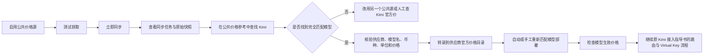

# TokenSea Kimi 采用 models.dev 或 LiteLLM 公共价格参考操作说明

> 文档版本：V1.0  
> 编制日期：2026-07-23  
> 关联文档：`TokenSea_Kimi模型接入至Virtual_Key完整操作指导书_V1.0_20260721.md`  
> 适用对象：TokenSea 平台管理员、实施人员、联调测试人员  
> 适用范围：使用 models.dev 或 LiteLLM 获取 Kimi 价格参考，并继续完成模型部署、价格匹配、路由及 Virtual Key 接入

---

## 1. 结论

可以使用 `models.dev 公共模型参考` 或 `LiteLLM 公共成本参考` 获取 Kimi 模型价格，但需要区分“公共参考价”和“生产生效价”。

TokenSea 当前价格链路为：

```text
公共价格源
→ 公共价格参考记录
→ 管理员核验并转录到供应商官方价格目录
→ 自动匹配模型部署
→ 生成模型生效价格
→ 路由、预算、成本计算使用生效价格
```

公共参考源同步完成后，只会写入公共参考数据，不会直接：

- 覆盖供应商官方价格目录；
- 自动生成生产生效价格；
- 自动参与路由成本计算；
- 自动成为供应商对账依据。

因此，采用公共参考源可以减少人工查价工作，但仍需经过“核验并转录”步骤，才能完成原指导书中的完整 Virtual Key 接入流程。

生产环境推荐原则：

```text
models.dev / LiteLLM：用于发现、参考、交叉核验
Kimi 官方页面、合同或账单：用于最终生产价格确认
```

测试环境可以临时采用公共参考价生成生效价格，但必须降低来源可信度、保留来源地址，并明确标识为测试用途。

---

## 2. TokenSea 当前两类公共价格源

TokenSea 已内置以下两个公共参考源，默认状态通常为“暂停”。

### 2.1 models.dev 公共模型参考

| 配置项 | 当前值 |
|---|---|
| 内置价格源 ID | `builtin_models_dev` |
| 适配器 | `MODELS_DEV` |
| 来源类别 | `PUBLIC_REFERENCE` |
| 来源地址 | `https://models.dev/api.json` |
| 官方域名 | `models.dev` |
| 默认币种 | `USD` |
| 默认同步周期 | 每天 `P1D` |

适合用途：

- 查看模型名称、供应商、上下文和公开价格；
- 获取按每百万 Token 组织的价格；
- 作为 Kimi 首选公共参考源；
- 与 LiteLLM 数据交叉比较。

### 2.2 LiteLLM 公共成本参考

| 配置项 | 当前值 |
|---|---|
| 内置价格源 ID | `builtin_litellm_cost_map` |
| 适配器 | `LITELLM_COST_MAP` |
| 来源类别 | `PUBLIC_REFERENCE` |
| 来源地址 | `https://raw.githubusercontent.com/BerriAI/litellm/main/model_prices_and_context_window.json` |
| 官方域名 | `raw.githubusercontent.com` |
| 默认币种 | `USD` |
| 默认同步周期 | 每天 `P1D` |

适合用途：

- 覆盖较多模型和供应商；
- 查看输入、输出、缓存读写等计费组件；
- 补充 models.dev 未覆盖的模型；
- 检查公共社区价格是否一致。

LiteLLM 数据常按“每 Token”存储。TokenSea 解析器会统一换算为：

```text
计费对象：TOKEN
计费基数：1000000
页面单位：每百万 Token
```

因此，从“公共价格参考”页面复制到供应商价格目录时，不需要再乘以或除以 1000。

---

## 3. 两个来源如何选择

建议顺序：

```text
优先 models.dev
→ 再用 LiteLLM 交叉核验
→ 最后用 Kimi 官方页面确认生产价格
```

| 场景 | 建议来源 |
|---|---|
| 快速查找 Kimi 标准输入、输出价 | models.dev |
| models.dev 未找到目标模型 | LiteLLM |
| 需要缓存价格等扩展计费项 | LiteLLM |
| 两个来源价格不一致 | 以 Kimi 官方页面、合同或账单为准 |
| 正式生产计费 | Kimi 官方价或实际渠道价 |
| 仅做 PoC 或联调 | 可使用公共参考价人工转录 |

公共来源可能存在以下差异：

- 模型标识不同；
- 供应商类型不同；
- 币种不同；
- 价格更新时间不同；
- 是否包含缓存、批量、长上下文等特殊计费不同；
- 新模型上线后收录时间不同。

不要因为名称相似，就把其他 Kimi 模型价格用于 `kimi-k2.6`。

---

## 4. 完整操作流程



---

## 5. 方案一：使用 models.dev 获取 Kimi 价格

### 5.1 进入价格源管理

菜单：

```text
高级治理 → 价格源管理
```

找到：

```text
models.dev 公共模型参考
```

检查以下配置：

| 字段 | 预期值 |
|---|---|
| 价格源类别 | 公共参考来源 |
| 适配器 | models.dev 公共参考 |
| 官方来源地址 | `https://models.dev/api.json` |
| 默认币种 | USD |
| 同步周期 | 每天 |
| 低风险自动发布 | 否 |

公共参考来源不能开启生产价格自动发布。

### 5.2 测试获取

点击：

```text
测试获取
```

成功标准：

- HTTP 状态为 200；
- Content-Type 可被识别；
- 响应未超过平台限制；
- 出口代理允许访问 `models.dev`；
- 页面不显示域名未授权、DNS、超时或内容格式错误。

### 5.3 启用并立即同步

依次点击：

```text
启用
立即同步
```

启用后，平台会按配置周期自动同步；“立即同步”用于本次接入直接获取最新数据。

### 5.4 查看同步结果

当前 Console 菜单未单独展示所有价格同步辅助页面，可直接访问：

```text
http://localhost:39210/provider-price-sync-runs
```

检查：

- 来源名称为 models.dev；
- 状态为“执行成功”或“无价格变化”；
- 获取记录数大于 0；
- 标准化记录数大于 0；
- 没有解析错误。

需要查看原始证据时访问：

```text
http://localhost:39210/provider-price-snapshots
```

原始快照会保留：

- 来源地址；
- 最终地址；
- HTTP 状态；
- 响应正文；
- SHA-256；
- 解析器版本；
- 获取时间。

### 5.5 查找 Kimi 公共价格参考

访问：

```text
http://localhost:39210/public-price-references
```

使用关键字依次搜索：

```text
moonshot
kimi
kimi-k2.6
```

找到记录后重点核对：

| 字段 | 核对要求 |
|---|---|
| 供应商 | 应能映射到 TokenSea 的 `moonshot` |
| 模型标识 | 必须与上游 `/v1/models` 返回值一致 |
| 币种 | 保留来源原币种 |
| 计费对象 | `TOKEN` |
| 计费基数 | `1000000` |
| 输入单位价格 | 每百万 Token 输入价格 |
| 输出单位价格 | 每百万 Token 输出价格 |
| 来源依据 | 保留完整地址 |
| 最近观测时间 | 应为近期同步时间 |

若只有 `kimi-k2`、`kimi-k2-thinking` 等其他模型，而没有 `kimi-k2.6`，不能将相近模型价格直接套用。

---

## 6. 方案二：使用 LiteLLM 获取 Kimi 价格

### 6.1 进入价格源管理

菜单：

```text
高级治理 → 价格源管理
```

找到：

```text
LiteLLM 公共成本参考
```

检查：

| 字段 | 预期值 |
|---|---|
| 价格源类别 | 公共参考来源 |
| 适配器 | LiteLLM 成本参考表 |
| 来源地址 | LiteLLM GitHub Raw JSON 地址 |
| 默认币种 | USD |
| 同步周期 | 每天 |
| 低风险自动发布 | 否 |

### 6.2 测试、启用与同步

依次执行：

```text
测试获取
启用
立即同步
```

若失败，优先检查：

- `raw.githubusercontent.com` 是否允许出网；
- DNS 是否正常；
- 出口代理是否刷新了价格源允许域名；
- GitHub Raw 是否被网络策略拦截；
- 响应是否为 JSON。

### 6.3 查找 Kimi 记录

访问：

```text
http://localhost:39210/public-price-references
```

搜索：

```text
moonshot
kimi
kimi-k2.6
```

LiteLLM 中模型标识可能带供应商前缀，例如：

```text
moonshot/kimi-k2.6
```

实际模型发现返回的模型名可能是：

```text
kimi-k2.6
```

转录到供应商官方价格目录时建议：

```text
供应商类型：moonshot
供应商模型名：kimi-k2.6
模型别名：moonshot/kimi-k2.6
```

这样既保持真实上游模型 ID，又能保留公共来源中的别名。

### 6.4 检查价格组件

LiteLLM 可能同时包含：

- 输入 Token；
- 输出 Token；
- 缓存读取；
- 缓存写入；
- 推理 Token；
- 图片、音频或请求级价格。

本次 Kimi Virtual Key 基础接入只需确认：

```text
INPUT_TOKEN
OUTPUT_TOKEN
```

缓存、批量、联网搜索等附加费用，只有在 TokenSea 对应计费组件和上游响应中均能准确识别时，才能纳入正式成本。

---

## 7. 公共参考价如何转为可用的生产价格

### 7.1 当前系统不会自动提升公共参考价

公共源同步后，数据保存在：

```text
public_model_price_reference
```

路由和成本计算实际使用的是：

```text
provider_model_price_catalog
→ price_version
```

所以必须进入：

```text
高级治理 → 供应商官方价格
```

将已核验的公共参考记录转录为供应商价格目录记录。

### 7.2 推荐的转录字段

| 字段 | 建议值 |
|---|---|
| 供应商类型 | `moonshot` |
| 供应商模型名 | `kimi-k2.6` |
| 模型别名 | 公共来源中带前缀的模型名，如 `moonshot/kimi-k2.6` |
| 币种 | 保留公共参考记录的原币种 |
| 计费对象 | `TOKEN` |
| 计费基数 | `1000000` |
| 输入单位价格 | 公共参考中的每百万 Token 输入价 |
| 输出单位价格 | 公共参考中的每百万 Token 输出价 |
| 来源类型 | `MANUAL_VERIFIED` |
| 来源依据 | 公共价格参考记录中的 `sourceRef` |
| 来源更新时间 | 公共记录最近观测时间 |
| 生效时间 | 当前时间或来源注明的生效时间 |
| 状态 | `ACTIVE` |

来源可信度建议：

| 核验程度 | 建议可信度 |
|---|---:|
| 仅一个公共来源 | 0.60 |
| models.dev 与 LiteLLM 结果一致 | 0.75 |
| 已与 Kimi 官方页面核验一致 | 1.00 |
| 已与合同或账单核验一致 | 1.00，并在对账模块保留正式依据 |

上述数值是 TokenSea 项目推荐治理策略，可按企业制度调整，但公共参考价不建议直接填 `1.00`。

### 7.3 币种处理原则

必须保留来源原始币种：

```text
来源为 USD → 供应商价格目录保存 USD
来源为 CNY → 供应商价格目录保存 CNY
```

不要在价格明细层手工把 USD 换算成 CNY。

TokenSea 的处理规则是：

```text
价格目录、价格版本、用量明细：保留原币种
用量看板、内部成本单、预算汇总：按月度汇率折算为 CNY
```

例如：

```text
公共参考价：0.50 USD / 百万输入 Token
供应商价格目录：仍保存 0.50 USD
调用明细：仍记录 USD 原始成本
汇总看板：按请求发生月份 USD→CNY 汇率折算
```

### 7.4 当前 Console 的 USD 录入限制

当前“供应商官方价格目录”页面的币种下拉框只提供 CNY，但 Control Plane 接口支持三位大写币种代码，包括 USD。

如果公共参考记录为 USD，可使用 Control Plane API 正确保留原币种。

PowerShell 示例：

```powershell
$token = "<TOKENSEA_ADMIN_TOKEN>"
$headers = @{
  Authorization = "Bearer $token"
  "Content-Type" = "application/json"
}

$body = @{
  providerType = "moonshot"
  providerModelName = "kimi-k2.6"
  displayName = "Kimi K2.6"
  aliases = @("moonshot/kimi-k2.6")
  currency = "USD"
  billingBasis = "TOKEN"
  billingQuantity = 1000000
  inputUnitPrice = <从公共价格参考复制>
  outputUnitPrice = <从公共价格参考复制>
  sourceType = "MANUAL_VERIFIED"
  sourceRef = "<公共价格参考记录的 sourceRef>"
  sourceConfidence = 0.60
  sourceUpdatedAt = (Get-Date).ToString("o")
  effectiveFrom = (Get-Date).ToString("o")
  status = "ACTIVE"
} | ConvertTo-Json -Depth 5

Invoke-RestMethod `
  -Method Post `
  -Uri "http://localhost:39211/api/provider-price-catalog" `
  -Headers $headers `
  -Body $body
```

注意：

- 不要把 `<从公共价格参考复制>` 原样提交；必须替换成数字；
- `providerModelName` 必须使用上游真实模型 ID；
- `aliases` 可保留公共来源中的带前缀模型名；
- API 返回成功后会立即尝试匹配已发现的模型部署。

---

## 8. 检查价格是否成功匹配到 Kimi 模型部署

### 8.1 查看供应商官方价格

菜单：

```text
高级治理 → 供应商官方价格
```

检查：

- 状态为启用；
- 已匹配部署数量大于 0；
- 供应商类型为 `moonshot`；
- 模型名为 `kimi-k2.6`；
- 币种和价格与公共参考记录一致。

若“已匹配部署”为 0，点击：

```text
重新匹配
```

### 8.2 查看模型部署

菜单：

```text
模型配置 → 模型部署
```

目标记录应满足：

```text
供应商渠道：Moonshot / Kimi 对应渠道
供应商模型：kimi-k2.6
价格状态：已匹配
价格匹配：精确匹配或别名匹配
```

若仍显示“缺少价格”，依次检查：

1. 供应商类型是否都是 `moonshot`；
2. 供应商模型名是否完全一致；
3. 是否需要增加别名；
4. 供应商价格是否启用；
5. 生效时间是否早于当前时间；
6. 是否存在同模型的其他活动价格版本导致覆盖关系异常。

### 8.3 查看模型生效价格

菜单：

```text
模型配置 → 模型生效价格
```

应看到：

- Moonshot / Kimi 渠道；
- `kimi-k2.6`；
- 原始币种；
- 每百万 Token 输入、输出价；
- 来源依据；
- 匹配方式；
- 状态为生效。

完成后，再继续原指导书中的：

```text
创建企业服务模型
→ 创建路由策略
→ 校验并生效
→ 发布企业服务模型
→ 创建租户、项目、应用
→ 创建并生成 Virtual Key
→ 真实调用验证
```

---

## 9. 两个公共来源同时存在时如何处理

### 9.1 价格完全一致

建议：

- 选择更新时间较新的记录作为主要转录来源；
- 将另一个来源作为交叉核验证据；
- 来源可信度可按内部策略提高，但未与 Kimi 官方核验前不建议设为 1；
- 保留两个公共价格源的原始快照和同步任务记录。

### 9.2 价格不一致

不要自动取平均值，也不要选择较低价格。

处理顺序：

```text
检查模型 ID
→ 检查币种
→ 检查计费基数
→ 检查更新时间
→ 检查是否为缓存/批量/长上下文价格
→ 查询 Kimi 官方页面
→ 以官方当前价格为准
```

### 9.3 只有一个来源存在目标模型

可以用于测试，但建议：

- 来源可信度不高于 0.60；
- 在生产启用前补做官方核验；
- 价格同步后观察后续变更；
- 不将该记录直接用于供应商财务对账。

### 9.4 两个来源都没有目标模型

说明公共来源尚未收录，或使用了不同模型名。

处理方式：

1. 使用 Kimi `/v1/models` 确认真实模型 ID；
2. 搜索可能的别名；
3. 检查原始快照；
4. 仍未找到时，按原指导书人工核验 Kimi 官方价格；
5. 不使用其他相近模型价格替代。

---

## 10. 与 CNY 统一汇总的关系

采用公共来源后，可能出现：

```text
Kimi 公共参考价格：USD
DeepSeek 中文官方价格：CNY
其他国外模型：USD
```

TokenSea 允许这些价格同时存在。

明细层：

```text
Kimi 调用保留 USD 原始成本
DeepSeek 调用保留 CNY 原始成本
```

汇总层：

```text
所有成本按请求发生月份的有效汇率统一折算为 CNY
```

如果 USD→CNY 月度汇率缺失：

- 模型不能正常参与预算成本核算；
- Gateway 可能返回 `TOKENSEA_FX_RATE_MISSING`；
- 看板会显示未折算记录；
- 内部成本单会标记汇率缺失异常。

上线前应先进入：

```text
成本管理 → 汇率管理
```

确认当月 USD→CNY 汇率已生效。

---

## 11. 推荐的生产治理规则

### 11.1 公共参考源不能直接自动发布生产价格

建议固定：

```text
sourceClass = PUBLIC_REFERENCE
autoPublish = false
```

公共参考源只能更新公共价格参考库，不应直接覆盖供应商生产价格。

### 11.2 生产价格需要明确责任人

将公共参考价转录到供应商价格目录时，应记录：

- 操作人；
- 来源地址；
- 来源观测时间；
- 是否与官方页面核验；
- 是否仅用于测试；
- 生效时间。

TokenSea 会保留操作审计和价格版本，不应覆盖或删除历史价格。

### 11.3 供应商账单优先级最高

推荐价格依据优先级：

```text
供应商合同或账单实际价
> 供应商官方公开价
> 已由管理员核验的公共参考价
> 单一公共参考价
```

公共参考价格适合模型发现、接入测试和成本估算，不应替代正式供应商对账。

---

## 12. 常见问题

### 12.1 同步成功，但公共价格参考中没有 Kimi

可能原因：

- 公共来源尚未收录；
- 模型使用了不同别名；
- 供应商字段不是 `moonshot`；
- 当前目标模型刚发布；
- 公共来源只收录了其他 Kimi 模型。

处理：搜索 `moonshot`、`kimi`、模型家族名，并查看原始快照。仍无结果则改用官方价格人工录入。

### 12.2 公共价格参考有记录，但模型部署仍显示缺少价格

原因：公共参考记录不会直接生成生效价格。

处理：将已核验记录转录到“供应商官方价格目录”，再执行重新匹配。

### 12.3 models.dev 和 LiteLLM 的供应商名不同

统一映射为 TokenSea 供应商模板类型：

```text
moonshot
```

公共来源中的原始模型名可放入模型别名。

### 12.4 公共来源是 USD，但页面只能选 CNY

当前 Console 存在币种选项限制。使用本文第 7.4 节 Control Plane API 创建 USD 价格，不能手工换算成 CNY 后冒充原始价格。

### 12.5 同步任务显示域名未授权

检查：

- 价格源的官方域名配置；
- 出口代理动态策略是否刷新；
- `models.dev` 或 `raw.githubusercontent.com` 是否允许访问；
- Control Plane 与出口代理是否可互相访问。

### 12.6 来源价格是每 Token，不是每百万 Token

LiteLLM 适配器会把每 Token 价格换算为每百万 Token，公共价格参考页面展示值已经是标准化结果，不要再次乘以 1,000,000。

### 12.7 公共来源包含缓存价格，供应商目录只有输入输出价格

基础接入先录入标准输入、输出价格。缓存和其他组件只有在完整成本链路可识别时再配置，避免少算或重复计算。

---

## 13. 验收清单

### 13.1 公共价格源

- [ ] models.dev 或 LiteLLM 测试获取成功；
- [ ] 价格源已启用；
- [ ] 立即同步成功；
- [ ] 同步任务有标准化记录；
- [ ] 原始快照和证据哈希可查看。

### 13.2 Kimi 公共价格参考

- [ ] 找到目标模型的完全匹配记录；
- [ ] 确认供应商可以映射为 `moonshot`；
- [ ] 确认模型 ID 与 Kimi `/v1/models` 一致；
- [ ] 确认币种；
- [ ] 确认计费基数为 1000000；
- [ ] 确认输入、输出价格；
- [ ] 保留来源地址和观测时间。

### 13.3 生产价格转录

- [ ] 已转录到供应商官方价格目录；
- [ ] 原始币种未被手工换算；
- [ ] 来源类型为人工核验；
- [ ] 来源可信度符合治理规则；
- [ ] 状态为启用；
- [ ] 已匹配部署数量大于 0。

### 13.4 后续链路

- [ ] 模型部署价格状态为已匹配；
- [ ] 模型生效价格已生成；
- [ ] 当月外币汇率已生效；
- [ ] 路由校验通过并生效；
- [ ] 企业服务模型已发布；
- [ ] Virtual Key 已生成；
- [ ] `/v1/models` 能看到企业服务模型；
- [ ] `/v1/chat/completions` 真实调用成功；
- [ ] 调用日志、用量和原始币种成本记录正确；
- [ ] 看板汇总成本正确折算为 CNY。

---

## 14. 最终建议

对于 Kimi 模型接入，推荐采用：

```text
models.dev 作为第一公共参考
+ LiteLLM 作为交叉核验
+ Kimi 官方价格作为生产最终确认
```

只使用公共参考源也可以完成测试链路，但必须经过人工转录，不能把公共参考同步结果误认为已经生成生产价格。

最稳妥的落地方式：

```text
公共源自动同步
→ 管理员核验目标模型
→ 保留原币种转录供应商价格
→ 自动匹配模型部署
→ 生成生效价格
→ 路由与 Virtual Key 使用
→ 汇总成本按月度汇率统一为 CNY
```
