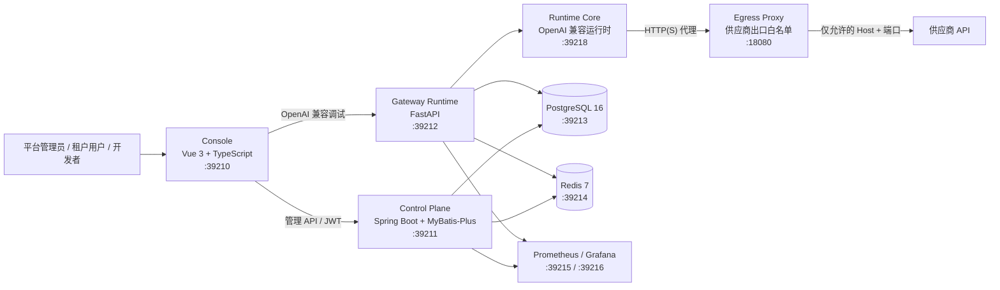
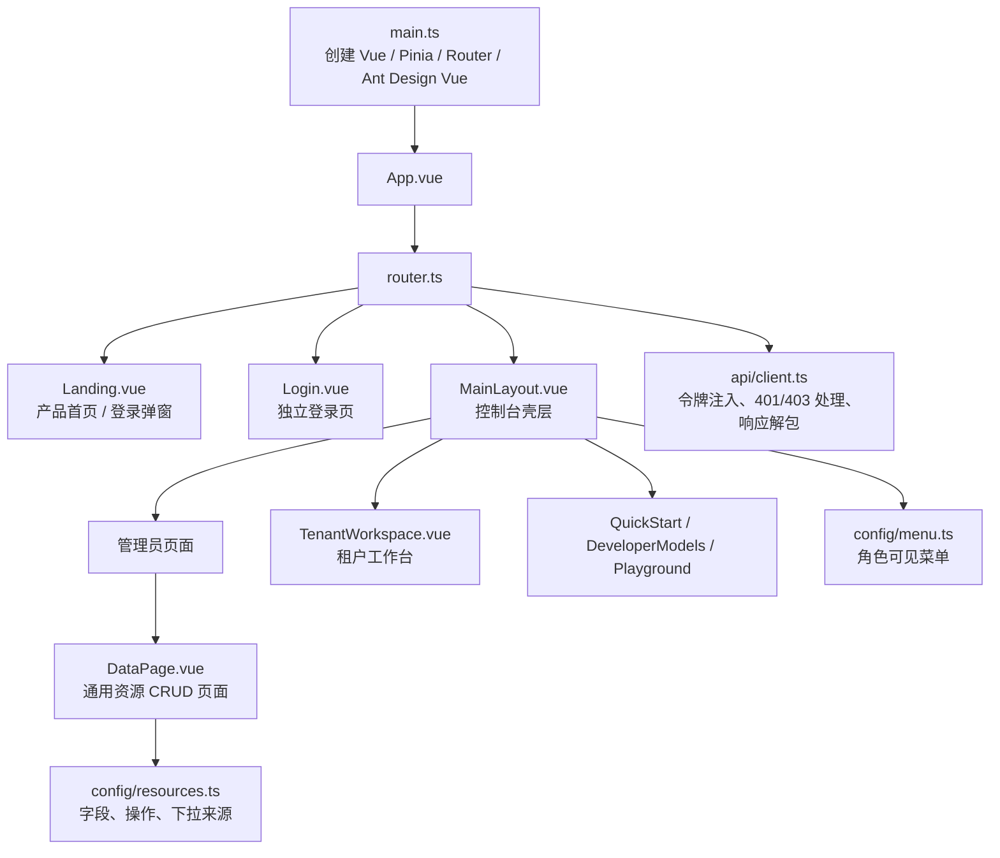
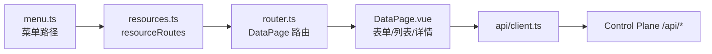
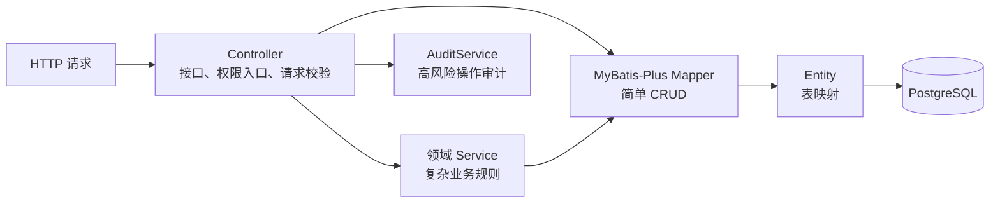
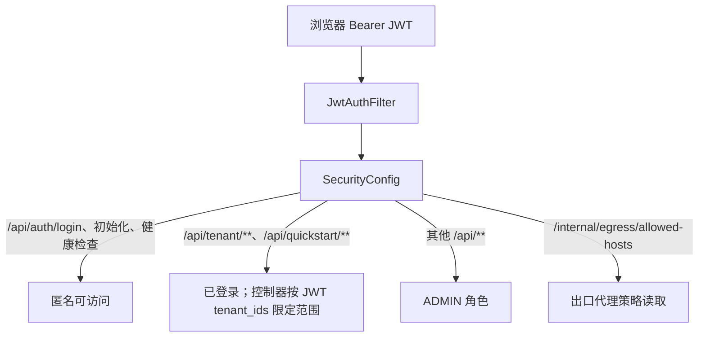
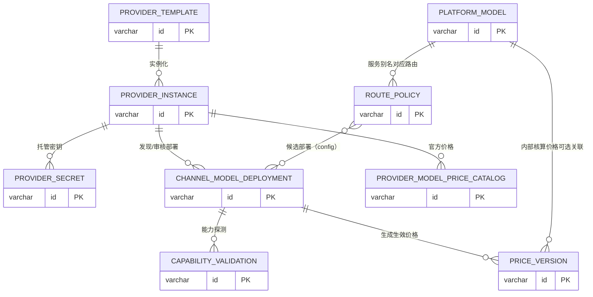
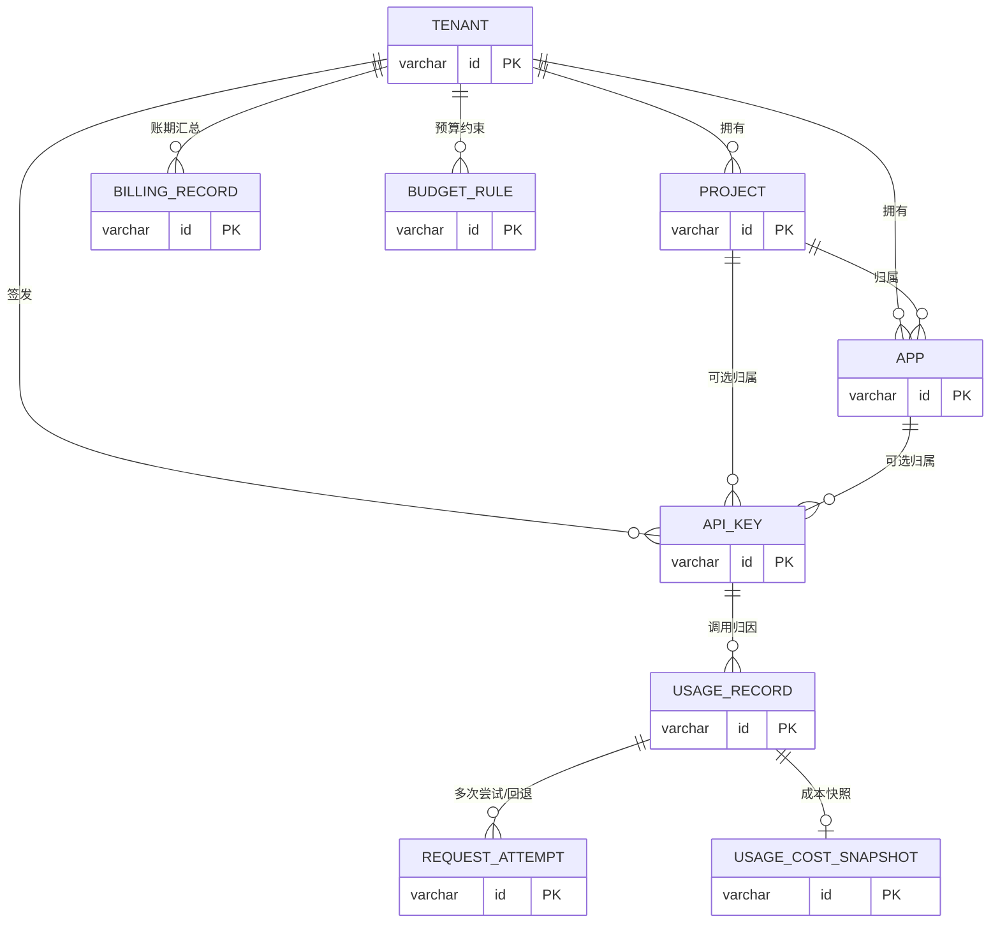
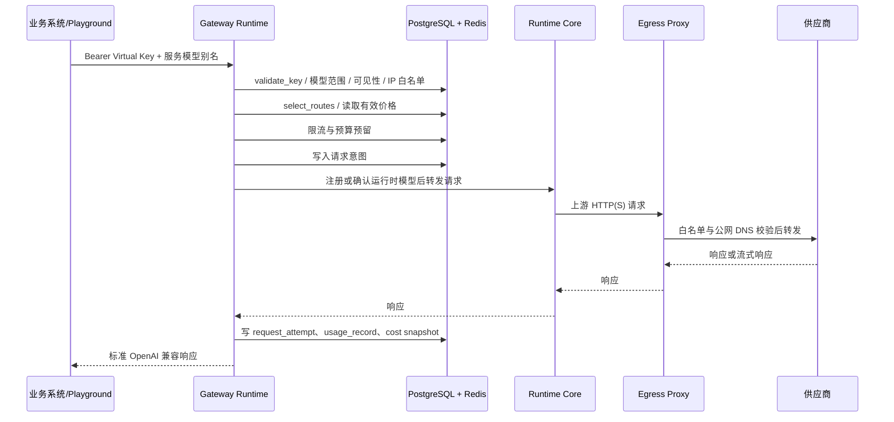
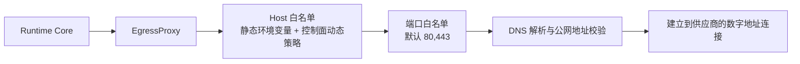

# TokenSea 代码知识图谱

- 版本：V1.0
- 日期：2026-07-14
- 范围：`apps/console`、`services/*`、`deploy/compose`、控制面 Flyway 迁移及其直接依赖。
- 阅读方式：本文用于定位代码、理解依赖和排查调用链；它是源码静态分析结果，不代表每个流程都已经完成端到端验收。

## 1. 全局架构图



部署入口为 [`deploy/compose/docker-compose.yml`](../deploy/compose/docker-compose.yml)。本地 Compose 项目名固定为 `tokensea`，对外端口默认仅绑定 `127.0.0.1`。

## 2. 仓库导航

```text
tokensea/
├─ apps/console/                    管理控制台与开发者门户
│  └─ src/
│     ├─ api/client.ts               Axios、JWT、API 响应解包
│     ├─ router.ts                   路由守卫与页面映射
│     ├─ config/menu.ts              菜单分组
│     ├─ config/resources.ts         通用数据页的资源/字段/操作配置
│     ├─ layouts/MainLayout.vue      全局壳层、导航、退出登录
│     └─ pages/                      业务页面
├─ services/control-plane/           管理控制面（Java 21 / Spring Boot）
│  └─ src/main/
│     ├─ java/com/tokensea/          按领域拆分的 Controller、Entity、Mapper、Service
│     └─ resources/db/migration/     Flyway V1～V14 前向迁移
├─ services/gateway-runtime/         统一调用入口（FastAPI）
│  └─ app/main.py                    鉴权、路由、预算、转发、记账、Outbox
├─ services/egress-proxy/            供应商出口代理与 Host/端口/DNS 安全校验
├─ deploy/compose/                   Docker Compose、环境变量样例
├─ configs/                          供应商、模型目录等受控配置
├─ docs/                             架构、接口、设计、交付与变更记录
├─ compliance/、security/            开源合规与安全治理材料
└─ packages/                         预留的共享包目录
```

## 3. 前端知识图谱

### 3.1 入口、鉴权与页面关系



`api/client.ts` 是前端接口的唯一基础客户端：从 `localStorage.tokensea_token` 取 JWT 并附加 `Authorization: Bearer` 请求头；响应数据通过 `unwrap` 和 `normalizePayload` 转换为前端 camelCase 字段。路由守卫将未登录用户导向 `/login`，并将非 `ADMIN` 用户从管理页导向 `/workspace`。

### 3.2 前端模块与职责

| 模块 | 关键文件 | 职责 | 主要后端接口 |
|---|---|---|---|
| 产品与身份 | `Landing.vue`、`Login.vue`、`api/client.ts` | 首页、登录、JWT 会话与角色识别 | `/api/auth/login`、`/api/dashboard/stats` |
| 控制台壳层 | `MainLayout.vue`、`menu.ts` | 顶栏、菜单、账号操作、角色菜单过滤 | `/api/dashboard/stats` |
| 通用后台资源 | `DataPage.vue`、`resources.ts` | 可配置的列表、详情、创建、编辑、审批与相关操作 | 各 `/api/*` 资源接口 |
| 模型资产 | `resources.ts` | 模板、渠道、公共参考、部署、服务模型、能力与价格 | `/api/provider-*`、`/api/channel-model-deployments`、`/api/platform-models` |
| 同步中心 | `resources.ts` | 模型发现、数据源、价格源、快照与差异审核 | `/api/data-sources`、`/api/sync-jobs`、`/api/provider-price-*` |
| 租户与访问 | `TenantWorkspace.vue`、`Keys.vue` | 租户/项目/应用、Virtual Key、租户范围数据 | `/api/tenants`、`/api/projects`、`/api/apps`、`/api/keys`、`/api/tenant/*` |
| 路由与治理 | `RoutePolicies.vue`、`CostStatements.vue` | 路由候选、价格校验、成本单 | `/api/routes`、`/api/price-versions`、`/api/cost-statements` |
| 开发者门户 | `QuickStart.vue`、`DeveloperModels.vue`、`Playground.vue` | 连通性检查、可见模型、真实 Key 调试 | `/api/quickstart/config`、`/api/tenant/models`、Gateway `/v1/*` |
| 观测与成本 | `Dashboard.vue`、`Calls.vue`、`Usage.vue`、`Billing.vue` | 运行概览、调用日志、用量、账单 | `/api/dashboard/stats`、`/api/usage`、`/api/billing` |

### 3.3 菜单 → 资源配置 → 接口

管理员菜单由 `config/menu.ts` 定义，数据型页面多数由 `config/resources.ts` 的 `resourceRoutes` 生成。新增一个标准后台资源时，优先沿用此链路：**菜单项 → 路由键 → ResourceProps 配置 → DataPage → API**，避免另写一套 CRUD 页面。



## 4. 控制面知识图谱

### 4.1 分层约定



简单资源通常继承 `BaseCrudController` 或复用 `ReadOnlyController`；涉及审批、连接测试、模型发现、价格同步、路由候选校验、记账等场景使用专用 Controller/Service。公共返回包装为 `ApiResponse`，实体公共字段继承 `BaseEntity`。

### 4.2 领域模块

| 领域 | 入口类 | 核心实体/表 | 关键职责 |
|---|---|---|---|
| 身份与安全 | `AuthController`、`JwtService`、`JwtAuthFilter`、`SecurityConfig` | `user_account`、`role`、`user_role`、`user_tenant` | 登录签发 JWT；`/api/**` 默认要求 `ADMIN`；`/api/tenant/**` 为已登录租户范围接口 |
| 初始化 | `BootstrapController` | `platform_bootstrap_state` | 首个管理员初始化与引导状态 |
| 租户与应用 | `TenantController`、`ProjectController`、`AppController`、`TenantWorkspaceController` | `tenant`、`project`、`app`、`api_key` | 责任边界、预算归属、默认 Key、租户工作台数据范围 |
| Key | `ApiKeyController` | `api_key`、`approval_task` | 申请、审批、生成一次性明文、禁用、模型范围与限流配置 |
| 供应商与密钥 | `ProviderTemplateController`、`ProviderInstanceController`、`ProviderSecretController`、`ProviderConnectionService` | `provider_template`、`provider_instance`、`provider_secret` | 供应商模板、企业渠道、密钥加密托管、连接测试 |
| 模型资产 | `ModelTemplateController`、`ModelCapabilityTagController`、`ModelDeploymentController`、`PlatformModelController` | `model_template`、`model_capability_tag`、`channel_model_deployment`、`platform_model` | 模型参考、渠道部署审核、企业服务模型发布 |
| 发现与能力 | `ModelDiscoveryController`、`CapabilityProbeController`、`SyncJobExecutor` | `data_source`、`sync_job`、`provider_model_snapshot`、`model_discovery_diff`、`capability_validation` | 发现供应商模型、记录原始快照、差异审核、在线能力探测 |
| 价格 | `ProviderPriceCatalogController`、`ProviderPriceCatalogService`、`ProviderPriceSyncController`、`ProviderPriceSyncService`、`PriceSourceParser` | `provider_model_price_catalog`、`provider_price_source`、`provider_price_raw_snapshot`、`provider_price_component`、`price_version` | 官方价目录、采集、解析、差异审核、匹配和生效价格版本 |
| 路由 | `RoutePolicyController`、`RouteCandidateValidator` | `route_policy`、`channel_model_deployment`、`price_version` | 校验部署审核状态、能力验证、价格有效性后才允许候选入路由 |
| 成本与预算 | `AccountingController`、`BillingRecordController` | `usage_record`、`request_attempt`、`usage_cost_snapshot`、`budget_rule`、`billing_record`、`cost_statement*` | 成本事实、预算规则、账单、内部成本单、调整与确认 |
| 治理与审计 | `GovernanceController`、`GovernanceApprovalService`、`AuditLogController`、`SnapshotAccessController` | `approval_request`、`governance_version`、`audit_log`、`sensitive_access_log` | 版本快照、审批、回滚、敏感数据查看理由和审计 |
| 运行与观测 | `DashboardController`、`RuntimeConfigController`、`EgressPolicyController`、`SystemContractController` | `provider_health`、`alert_event`、`error_code_registry`、`platform_setting` | 看板、运行时配置、出口白名单、错误码、系统设置 |

### 4.3 重要权限边界



`AuthController` 登录时从 `user_role` 和 `user_tenant` 读取角色与启用租户，写入 JWT 声明。因此角色或租户授权更新后，需要重新登录获得新的令牌声明。

## 5. 关键业务对象关系

### 5.1 模型资产到可调用服务模型



企业服务模型发布的代码约束集中在 `RouteCandidateValidator`：路由候选应同时满足部署已审核且可路由、存在通过的在线能力验证、存在当前生效的价格版本等条件。`platform_model` 面向业务调用方的是稳定别名，不应让业务系统直接绑定供应商真实模型名。

### 5.2 租户、应用、Virtual Key 与事实记录



事实表 `usage_record`、`request_attempt` 和 `usage_cost_snapshot` 用于请求、尝试及价格依据的可追踪记录；价格改动以新 `price_version` 生效，不应原地覆盖历史事实。

## 6. 网关运行时知识图谱

### 6.1 对外契约

| 路径 | 方法 | 入口函数 | 用途 |
|---|---:|---|---|
| `/health` | GET | `health` | 存活检查 |
| `/health/readiness` | GET | `readiness` | 数据库、缓存等就绪检查 |
| `/metrics` | GET | `metrics` | Prometheus 指标 |
| `/v1/models` | GET | `models` | 查询当前 Virtual Key 可用的企业服务模型 |
| `/v1/chat/completions` | POST | `chat_completions` | OpenAI 兼容对话调用 |
| `/v1/embeddings` | POST | `embeddings` | OpenAI 兼容向量调用 |
| `/v1/responses` | POST | `responses` | OpenAI 兼容响应调用 |

### 6.2 单次调用主链路



`services/gateway-runtime/app/main.py` 的关键函数可按下列顺序阅读：

1. `proxy_openai_compatible`：统一入口，解析请求和流式标记。
2. `validate_key`、`validate_model_scope`、`validate_visibility`、`validate_ip_whitelist`：验证 Virtual Key 与调用范围。
3. `select_routes`、`ordered_routes`、`load_price`：解析服务模型、候选路由和价格。
4. `reserve_rate_limits`、`reserve_budget`：在 Redis 中预留限流与预算。
5. `execute_non_stream` / `execute_stream`：调用 Runtime Core 并处理回退。
6. `safe_record_attempt`、`finalize_request`：写入请求尝试、用量和成本快照。
7. `enqueue_outbox`、`outbox_worker`：通过 PostgreSQL Outbox 与本地 WAL 提升记账事件的可恢复性。

### 6.3 网关关键依赖

| 依赖 | 用途 | 代码位置 |
|---|---|---|
| PostgreSQL | Key、路由、价格、用量、Outbox 持久化 | `asyncpg` / `main.py` |
| Redis | 限流、预算预留、运行期缓存 | `redis.asyncio` / Lua 脚本 |
| Runtime Core | 模型注册与实际 OpenAI 兼容请求转发 | `TOKENSEA_RUNTIME_ENGINE_URL` |
| Egress Proxy | 限制出站目标、防 SSRF/DNS 重绑定 | Runtime Core 的 `HTTP(S)_PROXY` |
| 本地 WAL | 数据库暂不可用时保存待写记账事件 | `TOKENSEA_OUTBOX_DIR` |

## 7. 出口代理与网络安全



`services/egress-proxy/app/proxy.py` 拒绝通配 Host、未列入白名单的 Host/端口以及回环、私网、链路本地、保留、组播等非公网地址。控制面 `EgressPolicyController` 提供动态白名单策略，避免把供应商目标放宽为任意公网地址。

## 8. 数据迁移演进图


迁移目录：`services/control-plane/src/main/resources/db/migration/`。已执行过的迁移不得修改；所有结构变化必须新增版本更高的 Flyway 文件。V13、V14 为当前工作树中的后续迁移，应以目标环境的 `flyway_schema_history` 为准确认实际应用版本。

## 9. 常用排查路径

| 现象 | 首先查看 | 再查看 |
|---|---|---|
| Console 请求 401/403 | `api/client.ts` 令牌和 JWT 角色 | `SecurityConfig`、`AuthController`、`user_role`、`user_tenant` |
| 供应商连接测试失败 | `ProviderConnectionService` | `EgressPolicyController`、出口代理日志、目标 Host 白名单 |
| 发现模型失败 | `ModelDiscoveryController`、`SyncJobExecutor` | 渠道密钥、数据源、出口白名单、`provider_model_snapshot` |
| 服务模型不能发布/路由 | `PlatformModelController`、`RouteCandidateValidator` | 部署审核、能力验证、价格版本、路由策略状态 |
| Gateway 调用被拒绝 | `validate_key`、`validate_model_scope` | Key 状态/审批、租户/项目/应用状态、IP 白名单、预算规则 |
| Gateway 无上游响应或回退 | `select_routes`、`execute_*`、`ensure_runtime_model` | Runtime Core、Egress Proxy、供应商状态、`request_attempt` |
| 用量或成本未出现 | `finalize_request`、`enqueue_outbox`、`outbox_worker` | `usage_record`、`usage_cost_snapshot`、`accounting_outbox`、WAL |

## 10. 修改定位指南

| 修改目标 | 优先修改位置 | 不应忽略的相邻契约 |
|---|---|---|
| 新增后台资源页 | `resources.ts`、`menu.ts`、相应 Controller | 路由守卫、中文枚举下拉、审计和权限 |
| 调整控制台布局/样式 | `pages/*.vue`、`MainLayout.vue`、`mvp.css`、`prototype.css` | 不改变 `api/client.ts` 的会话与 API 契约 |
| 新增模型治理规则 | 对应控制器/Service、`RouteCandidateValidator` | `channel_model_deployment`、`capability_validation`、`price_version` |
| 新增网关校验 | `gateway-runtime/app/main.py` 和定向 pytest | 非流式、流式、预算释放、Outbox 重试均需考虑 |
| 新增供应商目标 | 渠道/模板、`EgressPolicyController` 或受控白名单 | 禁止使用通配 Host，连接测试与发现模型均需验证 |
| 数据结构变更 | 新增 Flyway 迁移 | 旧迁移不可改；实体、Mapper、查询 SQL、运行时 SQL 同步审查 |

## 11. 相关入口文档

- [架构说明](architecture.md)
- [接口参考](api-reference.md)
- [部署说明](deployment.md)
- [供应商到 Virtual Key 使用流程](TokenSea_供应商到VirtualKey使用流程_V1.0.md)
- [供应商官方价格数据库化与自动匹配方案](design/TokenSea_供应商官方价格数据库化与自动匹配方案_V1.0.md)
- [修订记录](record/TOKENSEA_MVP_REVISION.md)

## 12. 维护规则

当新增服务、页面、控制面领域、Gateway 接口、迁移或关键调用规则时，应同步更新本文的：全局架构图、仓库导航、对应模块表、数据关系图及排查路径。仅有代码目录或页面入口不等于功能已完成；端到端可用性以真实供应商、真实 Key 和实际调用验证为准。
