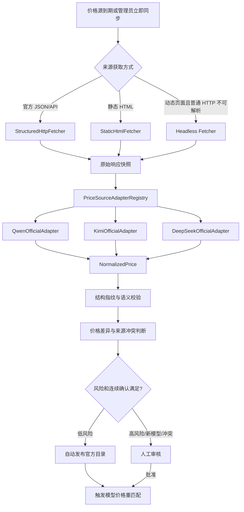

# TokenSea 千问与 Kimi 官方价格自动同步及新模型自动发现实施方案

版本：V1.0  
日期：2026-07-23  
文档状态：研发评审稿  
实施范围：千问（阿里云百炼中国内地）与 Kimi（Moonshot 中国站）的官方价格获取、定时自动更新、渠道级新模型自动发现、能力探测、价格匹配、生产准入和审计治理  
本次交付：仅输出实施方案，不修改代码、不执行数据库迁移、不部署 Docker

---

## 1. 结论

TokenSea 当前已经具备 DeepSeek 官方价格同步、公共价格参考、价格快照、差异审核、模型发现、能力探测、官方价格自动匹配和运行时成本快照等基础能力。千问与 Kimi 不应再各自复制一套独立流程，而应在现有框架上完成两类改造：

1. 将当前集中在 `PriceSourceParser` 中的分支式解析逻辑重构为可插拔价格适配器体系。
2. 将价格同步与模型发现改造成“独立调度、统一关联编排”的双链路，并补齐模型消失防抖、标准模型/部署版本/别名关系、生产人工确认和价格层级解析。

推荐目标链路：

```text
官方结构化价格接口（若经验证存在）
        │
        ├─ 不存在或不稳定
        ▼
官方定价文档 / 官方价格页面
        │
        ▼
受控 Fetcher：普通 HTTP 优先，Headless 仅兜底
        │
        ▼
QwenOfficialAdapter / KimiOfficialAdapter
        │
        ▼
原始快照 + 结构指纹 + 标准化价格
        │
        ▼
价格差异、连续确认、风险判断、审核或自动发布
        │
        ▼
provider_model_price_catalog
        │
        ├─────────────────────┐
        ▼                     ▼
渠道 /models 定时发现     官方模型目录候选发现
        │                     │
        └─────统一关联编排─────┘
                    │
                    ▼
标准模型 + 渠道模型部署 + 受控别名映射
                    │
                    ▼
真实能力探测 + 官方价格匹配 + 人工生产确认
                    │
                    ▼
可进入企业服务模型与生产路由
```

首期只落地：

- 千问：中国内地、标准实时推理、Token 计费；
- Kimi：中国站、标准实时推理、Token 计费；
- 官方明确提供缓存命中价时同步缓存组件；
- 数据结构预留区域、请求模式、服务层级、上下文阶梯、Batch、缓存写入及非 Token 计费扩展。

---

## 2. 已确认的方案边界

| 编号 | 已确认决策 | 实施含义 |
|---|---|---|
| 1 | 结构化官方来源优先，官方 HTML 兜底 | 不把 models.dev、LiteLLM 当作生产价格来源 |
| 2 | 新模型自动建档、匹配和探测，生产路由前人工确认 | 自动化不等于自动上线生产 |
| 3 | 账号实际 `/v1/models` 为模型存在性的主依据 | 价格页只证明“有价格”，不能证明当前账号可调用 |
| 4 | 低风险价格自动发布，高风险人工审核 | 兼顾自动化和成本安全 |
| 5 | 首期中国大陆标准实时价格，结构预留完整维度 | 控制首期范围，避免一次性覆盖全部产品形态 |
| 6 | 通用 JSON/CSV 适配器 + 供应商专用 HTML 适配器 | 核心流程不再持续膨胀 `if/else` |
| 7 | 按供应商渠道/账号分别发现，再归并统一目录 | 不假定同一供应商不同账号的模型权限一致 |
| 8 | `/models` 为主，官方文档候选为辅，真实探测后建立部署 | 解决模型列表不完整或接口缺失问题 |
| 9 | 价格同步与模型发现独立调度，统一编排重匹配 | 任一链路完成后都能补齐另一侧关系 |
| 10 | 没有官方或更高优先级有效成本价时不得进入生产路由 | 禁止零成本和公共参考价替代正式核算价 |
| 11 | 首期只落地千问、Kimi | 框架支持后续扩展智谱、MiniMax、百川等 |
| 12 | HTTP/API 优先，独立 Headless Fetcher 兜底 | 控制资源、漏洞面和抓取复杂度 |
| 13 | 官方价、渠道实际价、合同价分层保存 | 官方同步不得覆盖合同价或渠道实际价 |
| 14 | 标准模型、渠道部署版本、别名映射分层 | 禁止模糊匹配自动生效 |
| 15 | 阈值按价格源配置，首期默认 10% + 连续两次一致 | 不在代码中写死所有供应商阈值 |
| 16 | 连续 4 次未发现后再真实探测，探测失败才退出路由 | 防止 `/models` 短时异常导致生产模型误下线 |
| 17 | 官方来源按可信级别排序，冲突时停止自动发布 | 抓取顺序不能决定生产价格 |
| 18 | 文档达到研发评审和开发拆解深度 | 包含数据、接口、任务、状态、文件和验收标准 |

---

## 3. 方案依据

### 3.1 附件 PRD 与 LiteLLM 分析报告给出的约束

本方案沿用附件中的产品定位和术语：

- TokenSea 是企业内部统一 LLM API Gateway，而不是公网 API 转售平台；
- LiteLLM 作为数据面和多供应商适配底座，供应商治理、合同价格、企业核算、审计和版本控制由 TokenSea 控制面完成；
- 模型资产需要管理供应商、模型目录、上下文、价格、能力和状态；
- 成本需要区分输入、输出、缓存及多模态组件，并形成不可变使用与成本记录；
- 模型、价格、路由、Virtual Key 等关键变更必须可追踪、可回放、可对账；
- 国内供应商适配器插件体系属于平台优先能力。

附件并未给出千问、Kimi 当前官方页面结构、实时模型 ID 和最新价格，因此本方案对这些部分采用 2026-07-23 的官方文档调研结果，并与附件内容明确区分。

### 3.2 当前仓库已经具备的能力

当前代码中已经形成以下闭环：

```text
价格源
→ 定时同步
→ 原始快照
→ 标准化解析
→ 价格差异
→ 自动发布 / 人工审核
→ 供应商官方价格目录
→ 渠道模型部署价格匹配
→ PROVIDER_OFFICIAL 价格版本
→ Gateway 成本计算
→ usage_cost_snapshot 不可变快照
```

主要代码与数据映射如下：

| 能力 | 当前实现 |
|---|---|
| 价格源与任务 | `ProviderPriceSyncController`、`ProviderPriceSyncService` |
| 价格解析 | `PriceSourceParser` |
| 官方价格目录和部署匹配 | `ProviderPriceCatalogService` |
| 模型发现 | `ModelDiscoveryController`、`ProviderConnectionService` |
| 自动能力探测 | `ModelDiscoveryAutoProbeService`、`CapabilityProbeService` |
| 路由前置校验 | `RouteCandidateValidator` |
| 出口白名单 | `EgressPolicyController`、`services/egress-proxy` |
| 价格源数据 | `provider_price_source`、`provider_price_sync_run`、`provider_price_raw_snapshot` |
| 价格治理数据 | `provider_price_diff`、`provider_model_price_catalog`、`provider_price_component` |
| 模型治理数据 | `provider_model_snapshot`、`channel_model_deployment`、`model_discovery_diff`、`capability_validation` |
| 运行价格 | `price_version`、`usage_cost_snapshot` |

当前可直接复用的设计包括：

- ETag、Last-Modified、SHA-256 增量判断；
- 原始响应证据快照；
- `region/requestMode/serviceTier/contextTier` 价格范围；
- 输入、输出、缓存读写、推理等价格组件；
- 连续确认和低风险自动发布；
- 高风险审核；
- 发布后自动重匹配渠道部署；
- 缺少官方价格告警；
- Gateway 不按零价运行；
- 历史请求成本快照不可变。

### 3.3 当前实现的关键缺口

#### 3.3.1 价格适配器仍是集中分支

`PriceSourceParser.parse()` 当前按适配器代码执行 `switch`，DeepSeek HTML 解析逻辑直接放在同一个类中。继续增加千问、Kimi 后，会使解析器承担过多供应商差异，不利于独立测试、版本化和结构漂移处理。

#### 3.3.2 模型消失处理过于激进

当前 `ModelDiscoveryController` 在一次同步未发现模型时，会立即：

```text
review_status = MISSING
routing_status = SUSPENDED
```

这与已确认的“连续 4 次缺失后再真实探测”策略不一致，必须改成发现状态和健康状态分离。

#### 3.3.3 能力探测通过后自动获得路由资格

当前自动探测通过后可以自动更新为“已审核 / 可路由”。本方案要求增加独立的生产准入状态：技术探测成功只证明可调用，不能自动代表管理员批准进入生产。

#### 3.3.4 别名关系缺少独立治理表

当前官方价格匹配支持精确模型名和目录中的 `aliases`，但尚缺少：

- 别名来源证据；
- 标准模型与日期版本关系；
- 稳定别名指向变化历史；
- 别名人工审核状态；
- 生效和失效时间。

#### 3.3.5 价格层级缺少显式合同价

当前 `price_version` 已有：

```text
PUBLIC_REFERENCE
PROVIDER_OFFICIAL
CHANNEL_ACTUAL
INTERNAL_ACCOUNTING
```

但用户已确认合同价必须单独保存，因此应新增 `CONTRACT_PRICE`，而不是把合同价混入 `CHANNEL_ACTUAL`。

---

## 4. 官方来源策略

外部官方资料调研日期：2026-07-23。

### 4.1 千问 / 阿里云百炼

首期官方价格源建议：

```text
https://help.aliyun.com/zh/model-studio/model-pricing
```

该页面明确包含：

- 中国内地及多个国际区域；
- 精确 Model ID；
- 输入、输出每百万 Token 价格；
- 思考/非思考模式；
- 按单次输入 Token 数量划分的阶梯价；
- Batch 价格；
- 上下文缓存折扣；
- 稳定别名与日期版本的等价提示；
- 原价、限时折扣和免费额度等不同性质信息。

因此，千问适配器不能只抽取“模型名、输入价、输出价”三个字段，而要明确识别：

```text
providerModelName
region
requestMode
contextTier
inputUnitPrice
outputUnitPrice
billingQuantity
priceNature        ORIGINAL / PROMOTIONAL
promotionText
cachePolicyRef
batchDiscount
aliasTarget
```

首期发布规则：

- 仅接受“中国内地”标准实时推理的官方原价；
- 限时折扣、免费额度、活动价先保存为证据和候选，不直接成为默认生产成本；
- Batch 价格形成独立 `requestMode=BATCH` 记录，首期不进入标准实时路由；
- 上下文阶梯形成多个 `contextTier` 或组件作用域，不能压扁为单价；
- 稳定别名和日期版本只生成待审核映射，禁止直接模糊继承。

千问渠道发现应按具体 `provider_instance` 执行。阿里云当前文档说明 Base URL 与 API Key 计费方案、地域和业务空间相关，因此发现任务必须继承渠道自身的 Base URL、区域、业务空间和凭据，不能使用平台统一固定地址代替所有渠道。

实现阶段应验证两种发现方式，并按渠道配置选择：

1. 渠道 OpenAI 兼容 `/models`，若当前账号和端点确实支持；
2. 阿里云官方“可部署模型列表”接口，作为供应商专用发现适配器。

在真实联调完成前，不应在方案中假定所有百炼 OpenAI 兼容端点都完整支持 `/models`。

### 4.2 Kimi / Moonshot 中国站

首期渠道 Base URL：

```text
https://api.moonshot.cn/v1
```

官方文档已提供认证模型列表接口：

```text
GET /v1/models
Authorization: Bearer <MOONSHOT_API_KEY>
```

返回内容包含：

- 精确模型 ID；
- 上下文长度；
- 图片输入支持；
- 视频输入支持；
- 推理能力标记。

官方同时说明模型列表和能力标记可能变化，模型是否可访问还受账号层级影响。因此 Kimi 应完整执行“渠道级发现 + 真实调用探测”，而不能只依赖公开模型目录。

Kimi 官方定价采用按模型拆分的定价页面，首期应从官方定价索引发现价格子页面，再由 Kimi 专用适配器解析。当前官方页面已经体现：

- 价格单位按每 1M Token；
- 不同模型具有不同上下文长度；
- 自动上下文缓存；
- 思考/非思考差异；
- HighSpeed 等模型变体；
- 批量推理、联网搜索等功能存在独立定价入口。

首期范围：

- 中国站标准实时文本推理；
- 输入、输出 Token；
- 官方页面明确展示缓存价格时增加缓存读取组件；
- HighSpeed、Batch、联网搜索等保存为独立候选维度，不与标准价合并。

### 4.3 官方来源优先级

同一模型出现多个官方来源时，使用固定优先级：

```text
1. 供应商官方计费 API / 结构化价格接口
2. 官方计费与定价文档
3. 官方产品价格页面
4. 官方模型公告或说明
5. 官方控制台页面证据
```

以下来源不进入生产价格优先级：

```text
models.dev
LiteLLM Model Cost Map
第三方博客
搜索摘要
人工未经复核的转录
```

官方来源冲突时：

```text
生成 SOURCE_CONFLICT 差异
→ 暂停本次自动发布
→ 保持上一版 ACTIVE 价格
→ 要求管理员判断是否属于区域、套餐、促销或计费模式差异
```

---

## 5. 目标架构

### 5.1 价格同步链路



### 5.2 模型发现链路

```mermaid
flowchart TD
    A[渠道级发现任务 每6小时] --> B[ProviderModelDiscoveryAdapter]
    B --> C[/models 或供应商专用列表接口]
    C --> D[渠道模型原始快照]
    D --> E[新增/恢复/变化/连续缺失判断]
    E --> F[标准模型与受控别名匹配]
    F --> G[真实最小能力探测]
    G --> H[官方价格匹配]
    H --> I{探测、价格、映射是否完整?}
    I -->|否| J[保留候选并告警]
    I -->|是| K[待生产确认]
    K --> L[管理员确认]
    L --> M[可进入企业服务模型和路由]
```

### 5.3 双链路关联编排

新增 `ModelPriceOrchestrator`，不要把全部逻辑重新塞入价格同步服务或模型发现控制器。

触发事件：

```text
PRICE_SYNC_COMPLETED
PRICE_CATALOG_PUBLISHED
MODEL_DISCOVERY_COMPLETED
MODEL_PROBE_PASSED
MODEL_ALIAS_APPROVED
MODEL_RECOVERED
```

每次事件仅执行幂等的关联计算：

```text
定位 providerType + providerModelName + region + requestMode + serviceTier + contextTier
→ 校验精确名称或已批准别名
→ 计算可用成本价格层
→ 更新部署价格状态
→ 更新生产准入条件
→ 生成或关闭缺失告警
```

首期可使用 Spring 事务提交后的内部事件；为后续集群可靠性，建议同时写入轻量 `governance_event_outbox`，由后台任务幂等消费，避免进程中断造成漏匹配。

---

## 6. 价格适配器插件设计

### 6.1 接口

建议新增：

```java
public interface PriceSourceAdapter {
    String code();
    Set<String> supportedProviderTypes();
    Set<String> acceptedContentTypes();
    AdapterParseResult parse(AdapterContext context, FetchResult fetchResult);
    StructureFingerprint fingerprint(FetchResult fetchResult);
}
```

统一上下文：

```text
AdapterContext
- priceSourceId
- providerType
- region
- defaultCurrency
- requestMode
- sourcePriority
- parserVersion
- config
```

统一解析结果：

```text
AdapterParseResult
- prices: List<NormalizedPrice>
- aliases: List<ModelAliasCandidate>
- discoveredPricePages: List<OfficialSubPage>
- warnings
- structureFingerprint
- sourceEvidence
```

当前 `NormalizedPrice` 字段基本可复用，但建议增加：

```text
priceNature              ORIGINAL / PROMOTIONAL / FREE_QUOTA
pricingConditions        JSON
sourcePriority
sourceEvidencePath
sourcePublishedAt
```

### 6.2 适配器注册表

```text
PriceSourceAdapterRegistry
├─ LiteLlmReferenceAdapter
├─ ModelsDevReferenceAdapter
├─ OfficialJsonAdapter
├─ OfficialCsvAdapter
├─ DeepSeekOfficialAdapter
├─ QwenOfficialAdapter
└─ KimiOfficialAdapter
```

`ProviderPriceSyncService` 只依赖注册表，不再依赖具体供应商解析函数。

### 6.3 千问适配器职责

`QwenOfficialAdapter` 需要：

- 定位“文本生成-千问”范围，避免把其他供应商托管模型混入；
- 识别区域标题；
- 识别模型 ID、模式、上下文阶梯、输入价、输出价；
- 区分原价、促销价、免费额度；
- 解析 Batch 和缓存提示为附加条件，而不是默认覆盖标准价；
- 识别“当前能力等同于某日期版本”并生成别名候选；
- 当表头、列数、价格单位、币种或区域结构异常时快速失败；
- 对每条价格保存表格标题、行文本或 DOM 路径证据。

### 6.4 Kimi 适配器职责

`KimiOfficialAdapter` 建议分两步：

```text
KimiPricingIndexAdapter
→ 发现官方模型价格子页面

KimiModelPricingPageAdapter
→ 解析具体模型价格及说明
```

职责包括：

- 从定价索引识别模型子页面；
- 解析精确 API 模型名和模型变体；
- 解析每百万 Token 价格；
- 识别上下文长度、思考模式、HighSpeed、自动缓存；
- 将 Batch、联网搜索等独立功能价分离；
- 子页面新增时生成新模型价格候选；
- 页面只有模型说明但价格表未出现在普通 HTML 中时，标记“需要动态渲染”或“结构化内容缺失”，不得生成零价。

### 6.5 页面结构指纹

每个 HTML 适配器必须计算结构指纹，例如：

```text
页面主标题
关键表头集合
价格单位文本
模型 ID 正则命中数量
表格列数分布
关键区块顺序
```

处理规则：

```text
指纹一致 + 解析完整
→ 正常继续

指纹变化但仍可解析
→ SOURCE_STRUCTURE_CHANGED，高风险审核

指纹变化且字段不完整
→ 同步失败、来源 DEGRADED、保留旧价
```

---

## 7. 获取器设计与 Headless 兜底

### 7.1 获取模式

给价格源增加：

```text
fetchMode = AUTO | STRUCTURED_HTTP | STATIC_HTML | HEADLESS
```

`AUTO` 的决策顺序：

```text
官方结构化 API/JSON/CSV
→ 普通 HTTPS 获取
→ 确认页面依赖 JavaScript 后才使用 Headless
```

### 7.2 独立 Headless Fetcher

不得把 Playwright/Chromium 直接嵌入 Control Plane 主进程。建议新增独立服务：

```text
services/price-page-fetcher
```

安全约束：

- 非 root 运行；
- 独立容器和资源限额；
- 仅允许数据库已批准的精确官方域名；
- 禁止访问私网、回环、链路本地和云元数据地址；
- 禁止文件下载、上传、剪贴板、摄像头和麦克风；
- 限制重定向次数、脚本执行时间、页面大小和总响应大小；
- 不接收供应商推理 Key；
- 只返回最终 HTML、可见文本、网络结构化响应候选和证据哈希；
- 获取失败时不清空旧快照、不改写生效价格。

首期只有在千问或 Kimi 普通 HTTP 无法安全得到价格表时才启用该服务，避免不必要地扩大部署复杂度。

---

## 8. 模型发现与生命周期

### 8.1 发现来源

每个供应商渠道独立配置发现策略：

```text
discoveryAdapter
modelsEndpoint
scheduleExpression = PT6H
missingConfirmations = 4
probeOnNewModel = true
probeOnRecovery = true
```

可信度：

```text
渠道认证模型接口
→ 账号实际可见，创建渠道部署候选

官方模型目录/文档
→ 创建模型候选，不直接创建可路由部署

models.dev / LiteLLM
→ 只做提示和交叉核验
```

### 8.2 推荐状态拆分

不要继续只依赖 `review_status` 和 `routing_status` 两列承载全部语义。建议增加：

```text
discovery_status
- DISCOVERED
- SUSPECTED_MISSING
- MISSING_CONFIRMED
- RECOVERED

health_status
- UNKNOWN
- PROBE_PENDING
- HEALTHY
- DEGRADED
- UNAVAILABLE

price_status
- MISSING
- MATCHED_OFFICIAL
- MATCHED_CHANNEL
- MATCHED_CONTRACT
- CONFLICT

production_status
- CANDIDATE
- READY_FOR_REVIEW
- APPROVED
- REJECTED
- SUSPENDED
```

### 8.3 新模型状态机

```text
发现渠道新模型
→ DISCOVERED / PROBE_PENDING / CANDIDATE
→ 自动执行最小 CHAT 探测

探测失败
→ HEALTH=UNAVAILABLE
→ 保留部署和证据
→ 不进入路由

探测成功但无正式价格
→ HEALTHY / PRICE=MISSING
→ 保留为“已验证、缺少价格”

探测成功且匹配官方/渠道/合同成本价
→ READY_FOR_REVIEW

管理员确认
→ PRODUCTION=APPROVED
→ 路由校验时才允许进入候选
```

即使当前自动探测逻辑会自动把部署设置为 `APPROVED/ELIGIBLE`，实施后也必须增加独立 `production_status`，避免技术状态和业务准入混用。

### 8.4 模型消失防抖

当前一次未发现即暂停路由的逻辑应改为：

```text
第1次未发现
→ missing_streak = 1
→ SUSPECTED_MISSING
→ 不影响路由

连续第2～3次未发现
→ 累加 missing_streak
→ 告警升级但不下线

连续第4次未发现
→ 执行最小真实调用探测

探测成功
→ 目录不可见但调用正常
→ 保持原生产状态
→ HEALTHY + SUSPECTED_MISSING
→ 生成异常告警

探测失败
→ MISSING_CONFIRMED + UNAVAILABLE + SUSPENDED
→ 自动退出新请求和 Fallback 候选
→ 保留全部历史数据
```

恢复流程：

```text
重新在目录出现
→ missing_streak 清零
→ 执行恢复探测
→ 探测成功后进入 READY_FOR_REVIEW
→ 管理员确认后恢复生产
```

不自动物理删除模型部署、价格版本、能力记录、调用记录和审计记录。

### 8.5 标准模型、版本和别名

推荐三层关系：

```text
public_model_reference       标准模型目录
channel_model_deployment     具体渠道可调用模型 ID
provider_model_alias         受控别名/版本关系
```

别名关系类型：

```text
EXACT_ALIAS       官方明确等价别名
STABLE_ALIAS      稳定名称指向具体版本
VERSION_OF        日期版本属于某标准模型
VARIANT_OF        HighSpeed、思考版等变体
```

自动匹配顺序：

```text
1. 精确 API 模型 ID
2. 已批准且在有效期内的 EXACT_ALIAS / STABLE_ALIAS
3. 其他关系只生成候选，不自动绑定价格
```

前缀、编辑距离或大小写之外的模糊匹配只能用于建议，不能直接生效。

---

## 9. 价格同步、差异和自动发布

### 9.1 调度建议

```text
官方价格同步：每天 1 次
渠道模型发现：每 6 小时 1 次
失败重试：1 小时后
连续失败 3 次：来源标记 DEGRADED 并告警
管理员立即同步：保留
管理员测试获取/测试解析：保留并增强
```

价格任务与发现任务分别记录、分别加锁。任一成功完成后，都触发一次关联重匹配。

### 9.2 低风险自动发布条件

千问和 Kimi 首期默认：

```text
maxAutoChangeRatio = 0.10
confirmationRuns = 2
autoPublish = true
```

同时满足以下条件才可自动发布：

- 官方来源；
- 精确模型 ID 或已批准别名；
- 区域、模式、服务层级、上下文阶梯完全一致；
- 币种和计费基数未变化；
- 价格组件结构未变化；
- 页面结构指纹正常；
- 新旧价格差异绝对值不超过 10%；
- 连续两次标准化结果及证据哈希一致；
- 不存在高优先级官方来源冲突；
- 不是新模型首次定价。

### 9.3 必须人工审核

- 新模型首次价格；
- 模型删除；
- 币种变化；
- 每千 Token 与每百万 Token 等基数变化；
- 输入/输出/缓存/Batch/搜索等组件增删；
- 上下文阶梯变化；
- 区域、模式、服务层级变化；
- 稳定别名指向变化；
- 价格变化超过阈值；
- 原价与促销价性质变化；
- 页面结构指纹变化；
- 多个官方来源冲突；
- 模型名只能模糊匹配。

### 9.4 失败行为

```text
同步失败
→ provider_price_sync_run = FAILED
→ provider_price_source = DEGRADED
→ 生成告警
→ 上一条 ACTIVE 价格继续生效
→ 不生成零价
→ 不自动删除目录价格
```

对于页面中暂时没有价格值、只展示模型说明的情况，必须记录“价格字段缺失”，不能把空白转为 0。

---

## 10. 官方价、渠道价和合同价分层

### 10.1 价格层级

建议将 `price_version.price_layer` 扩展为：

```text
PUBLIC_REFERENCE
PROVIDER_OFFICIAL
CHANNEL_ACTUAL
CONTRACT_PRICE
INTERNAL_ACCOUNTING
```

含义：

| 层级 | 含义 | 是否由官方同步覆盖 |
|---|---|---|
| `PUBLIC_REFERENCE` | models.dev、LiteLLM 等参考价 | 否 |
| `PROVIDER_OFFICIAL` | 供应商公开目录原价 | 是，仅更新自身版本 |
| `CHANNEL_ACTUAL` | 当前账号、充值套餐或代理渠道实际成本 | 否 |
| `CONTRACT_PRICE` | 企业协议合同价格 | 否 |
| `INTERNAL_ACCOUNTING` | 企业内部核算或分摊价 | 否 |

### 10.2 有效成本价格优先级

```text
有效 CONTRACT_PRICE
> 有效 CHANNEL_ACTUAL
> 有效 PROVIDER_OFFICIAL
> 无正式成本价，禁止生产路由
```

`INTERNAL_ACCOUNTING` 是内部预算和分摊层，不应反向替代供应商实际成本；`PUBLIC_REFERENCE` 永远不参与生产成本解析。

### 10.3 价格解析服务

建议新增 `EffectiveCostPriceResolver`：

```text
输入：deploymentId + requestTime + region + requestMode + contextTier
输出：
- effectivePriceVersionId
- effectivePriceLayer
- currency
- components
- resolutionReason
- sourceEvidence
```

Gateway、路由校验、预算预占和对账均调用同一套规则，避免不同模块各自判断价格层级。

官方价格更新后：

- 只创建新的 `PROVIDER_OFFICIAL` 版本；
- 不退休有效合同价和渠道实际价；
- 可重新计算相对官方价折扣；
- 合同即将到期或合同价明显高于官方价时生成治理提示；
- 历史成本快照不变。

---

## 11. 数据库改造建议

下一迁移版本建议：

```text
V23__qwen_kimi_official_pricing_and_model_discovery_governance.sql
```

必须保持向前迁移，不修改 V1～V22。

### 11.1 扩展 `provider_price_source`

新增字段：

```text
fetch_mode varchar(30) default 'AUTO'
source_priority int default 100
price_nature varchar(30) default 'ORIGINAL'
structure_fingerprint varchar(128)
last_structure_fingerprint varchar(128)
structure_changed_at timestamptz
```

扩展 `adapter_code`：

```text
QWEN_OFFICIAL_PAGE
KIMI_OFFICIAL_PAGE
```

内置价格源建议迁移时创建为 `PAUSED`，管理员完成“测试获取 + 测试解析”后再启用：

```text
builtin_qwen_cn_official_price
builtin_kimi_cn_official_price
```

默认值：

```text
region = cn
currency = CNY
schedule = P1D
auto_publish = true
max_auto_change_ratio = 0.10
confirmation_runs = 2
status = PAUSED
```

### 11.2 扩展价格差异

`provider_price_diff.diff_type` 建议增加：

```text
SOURCE_CONFLICT
PRICE_NATURE_CHANGED
CONTEXT_TIER_CHANGED
ALIAS_TARGET_CHANGED
```

新增：

```text
source_priority
source_conflict_group
structure_fingerprint
```

### 11.3 新增模型别名治理表

```text
provider_model_alias
- id
- provider_type
- canonical_model_id
- provider_model_name
- target_provider_model_name
- relation_type
- region
- source_type
- source_ref
- raw_snapshot_id
- evidence_hash
- review_status
- effective_from
- effective_to
- created_at
- updated_at
```

唯一约束建议包含：

```text
provider_type + provider_model_name + region + relation_type + effective_from
```

### 11.4 新增官方模型候选表

```text
model_discovery_candidate
- id
- provider_type
- candidate_model_name
- display_name
- source_type
- source_ref
- evidence_hash
- region
- raw_attributes
- channel_verified_count
- status
- first_seen_at
- last_seen_at
```

该表承载“官方文档已出现、但当前渠道 `/models` 尚不可见”的候选模型，不能直接进入生产部署。

### 11.5 扩展 `channel_model_deployment`

新增：

```text
discovery_status
health_status
price_status
production_status
missing_streak int default 0
last_missing_at
last_probe_at
last_probe_status
production_approved_by
production_approved_at
production_decision_reason
recovery_requires_review boolean default false
```

兼容迁移：

- 现有 `APPROVED + ELIGIBLE + LIVE_PROBE PASSED` 的部署，可初始化为 `production_status=APPROVED`，避免升级后全部中断；
- 当前 `MISSING` 部署初始化为 `MISSING_CONFIRMED/SUSPENDED`；
- 新部署统一从 `CANDIDATE` 开始。

### 11.6 扩展价格层

`price_version.price_layer` 增加：

```text
CONTRACT_PRICE
```

建议增加合同元数据：

```text
contract_id
contract_name
provider_instance_id
contract_reference
```

若项目已有独立合同管理规划，可先只保留 `contract_id/contract_reference`，不在本次建设完整合同业务模块。

### 11.7 事件 Outbox

建议新增：

```text
governance_event_outbox
- id
- event_type
- aggregate_type
- aggregate_id
- payload
- status
- retry_count
- next_retry_at
- created_at
- processed_at
```

用于价格发布、模型发现和能力探测完成后的可靠重匹配。

---

## 12. 后端服务与 API 改造

### 12.1 保留并增强现有接口

现有接口继续使用：

```text
POST /api/provider-price-sources/{id}/test
POST /api/provider-price-sources/{id}/sync
GET  /api/provider-price-sync-runs
GET  /api/provider-price-diffs
POST /api/provider-instances/{id}/discover-models
GET  /api/provider-instances/{id}/deployments
```

### 12.2 建议新增接口

#### 价格源

```text
POST /api/provider-price-sources/{id}/test-parse
```

返回：

- 获取方式；
- Content-Type；
- 结构指纹；
- 解析条数；
- 示例标准化记录；
- 警告；
- 是否需要 Headless；
- 不发布任何价格。

#### 模型候选和别名

```text
GET  /api/model-discovery-candidates
POST /api/model-discovery-candidates/{id}/verify
GET  /api/provider-model-aliases
POST /api/provider-model-aliases
POST /api/provider-model-aliases/{id}/approve
POST /api/provider-model-aliases/{id}/reject
```

#### 生产准入

```text
POST /api/model-deployments/{id}/approve-production
POST /api/model-deployments/{id}/reject-production
POST /api/model-deployments/{id}/suspend-production
```

批准前强制校验：

```text
真实能力探测通过
+ 正式有效成本价格存在
+ 模型映射无冲突
+ 渠道连接测试有效
+ 未处于确认消失或不可用状态
```

#### 有效价格解析

```text
GET /api/model-deployments/{id}/effective-cost-price
```

用于页面展示最终采用合同价、渠道价还是官方价，并说明解析理由。

### 12.3 调度职责

```text
ProviderPriceSyncService
→ 只负责价格源任务

ModelDiscoveryScheduler / SyncJobExecutor
→ 只负责渠道模型发现

ModelPriceOrchestrator
→ 关联匹配和状态计算

EffectiveCostPriceResolver
→ 统一价格层级解析

ProductionEligibilityService
→ 统一生产准入判断
```

避免在 Controller 中继续积累事务和业务编排代码。

---

## 13. 路由与运行时改造

### 13.1 路由候选校验

`RouteCandidateValidator` 应同时要求：

```text
discovery_status 不是 MISSING_CONFIRMED
health_status = HEALTHY
production_status = APPROVED
LIVE_PROBE = PASSED
有效成本价格解析成功
```

价格层不应再只判断 `PROVIDER_OFFICIAL` 或 `CHANNEL_ACTUAL`，而应调用 `EffectiveCostPriceResolver`，支持：

```text
CONTRACT_PRICE > CHANNEL_ACTUAL > PROVIDER_OFFICIAL
```

### 13.2 Gateway 成本计算

Gateway 继续保存原币种、原金额和组件快照。价格自动更新后：

- 新请求使用新的有效价格版本；
- 历史请求不回算；
- Fallback 后按实际命中的部署和该部署有效价格计算；
- 找不到有效成本价时返回明确错误，不按 0 运行；
- CNY 聚合继续使用平台现有月度汇率能力，不改变价格源原币种。

### 13.3 上下文阶梯

千问存在按单次输入 Token 总量决定整次请求单价的情况。当前简单 `inputUnitPrice/outputUnitPrice` 不足以表达所有阶梯。

建议在 `price_components.scope` 中支持：

```json
{
  "minInputTokensExclusive": 32000,
  "maxInputTokensInclusive": 128000,
  "pricingApplication": "WHOLE_REQUEST"
}
```

Gateway 在请求完成后根据最终输入 Token 落入的阶梯选择整次输入、输出价。预算预占阶段可按最大可能阶梯或请求声明的上下文估算，结算阶段按实际 Token 重算。

首期若尚未完成阶梯运行时计算，则千问存在阶梯的模型不得标记为“价格完整并可生产”，不能静默使用第一档价格。

---

## 14. Console 改造

### 14.1 价格源管理

新增适配器选项：

```text
千问官方价格页
Kimi 官方价格页
```

新增字段：

```text
获取模式
来源优先级
价格性质
结构指纹
最近结构变化时间
```

操作增加：

```text
测试解析
查看结构指纹
```

### 14.2 价格差异审核

增加可见信息：

- 官方来源优先级；
- 原价/促销价；
- 上下文阶梯；
- Batch/标准实时；
- 别名目标；
- 来源冲突组；
- 结构指纹变化；
- 连续确认进度。

### 14.3 模型部署

列表应同时显示中文状态：

```text
发现状态
健康状态
价格状态
生产状态
连续缺失次数
最近探测时间
```

操作：

```text
重新发现
重新探测
查看价格匹配
确认进入生产
暂停生产
查看别名关系
```

### 14.4 新增候选和别名审核页面

建议在“高级治理”中增加：

```text
模型候选
模型别名审核
```

公共参考来源发现的模型仅显示为参考；官方文档候选和渠道实际发现必须用不同标签表达，不能让管理员误以为二者可信度相同。

---

## 15. 文件级改造清单

### 15.1 数据库

新增：

```text
services/control-plane/src/main/resources/db/migration/
V23__qwen_kimi_official_pricing_and_model_discovery_governance.sql
```

### 15.2 价格适配器

建议新增目录：

```text
services/control-plane/src/main/java/com/tokensea/governance/pricing/adapter/
```

新增文件：

```text
PriceSourceAdapter.java
PriceSourceAdapterRegistry.java
AdapterContext.java
AdapterParseResult.java
DeepSeekOfficialAdapter.java
QwenOfficialAdapter.java
KimiOfficialAdapter.java
OfficialJsonAdapter.java
OfficialCsvAdapter.java
LiteLlmReferenceAdapter.java
ModelsDevReferenceAdapter.java
```

调整：

```text
PriceSourceParser.java
```

处理方式：保留为兼容门面，内部委托注册表；待调用点全部迁移后再决定是否删除，避免一次性大范围重构。

### 15.3 获取器

建议新增：

```text
services/control-plane/src/main/java/com/tokensea/governance/pricing/fetch/
PriceContentFetcher.java
StructuredHttpFetcher.java
StaticHtmlFetcher.java
HeadlessFetcherClient.java
PriceFetchPolicy.java
```

可选新增服务：

```text
services/price-page-fetcher/
```

涉及部署配置时再修改：

```text
deploy/compose/docker-compose.yml
deploy/compose/docker-compose.dev.yml
deploy/compose/.env.example
services/egress-proxy/app/proxy.py
```

本方案阶段仅补充部署配置要求，不直接修改真实 `.env`、不重启或重建 Docker 服务。

#### 15.3.1 出口白名单与 `.env` 配置步骤

供应商渠道连接测试、模型发现和能力探测均会访问供应商 API。为避免每新增一个常见模型供应商都手工修改 `.env`，TokenSea 在权威模板 `deploy/compose/.env.example` 中统一预置当前内置供应商目录使用的固定 API 主机名。由该模板创建的新环境默认即可连接这些供应商，不再逐个追加域名。

未进入预置清单的资源专属、区域专属、企业私有或自定义 API Base 仍必须人工审核并追加精确主机名，否则控制面返回：

```text
PROVIDER_TARGET_NOT_ALLOWED: 供应商目标未列入出口白名单
```

部署人员按以下步骤处理：

1. 打开实际 Compose 环境文件：

   ```text
   deploy/compose/.env
   ```

   首次部署时应由 `deploy/compose/.env.example` 复制生成，不得把包含真实密钥的 `.env` 提交到代码仓库。已有环境升级时，将模板中的统一基线同步到实际 `.env`，同时保留已批准的内网测试或企业专属域名。

2. `TOKENSEA_ALLOWED_EGRESS_HOSTS` 默认统一包含以下固定主机名：

   | 供应商或平台 | 预置 API 主机名 |
   |---|---|
   | OpenAI | `api.openai.com` |
   | Anthropic Claude | `api.anthropic.com` |
   | Google Gemini | `generativelanguage.googleapis.com` |
   | DeepSeek | `api.deepseek.com` |
   | 阿里云百炼 / Qwen | `dashscope.aliyuncs.com` |
   | 智谱 GLM | `open.bigmodel.cn` |
   | 火山方舟 / 豆包 | `ark.cn-beijing.volces.com` |
   | 百度千帆 | `qianfan.baidubce.com` |
   | 讯飞星火 | `spark-api-open.xf-yun.com` |
   | 腾讯混元 | `api.hunyuan.cloud.tencent.com` |
   | Moonshot / Kimi | `api.moonshot.cn` |
   | MiniMax | `api.minimaxi.com`、兼容既有模板的 `api.minimax.chat` |
   | SiliconFlow | `api.siliconflow.cn` |
   | Mistral AI | `api.mistral.ai` |
   | Cohere | `api.cohere.com` |
   | Groq | `api.groq.com` |
   | Together AI | `api.together.xyz` |
   | Perplexity | `api.perplexity.ai` |
   | xAI / Grok | `api.x.ai` |
   | Xiaomi MiMo 按量付费 | `api.xiaomimimo.com` |
   | Xiaomi MiMo Token Plan | `token-plan-cn.xiaomimimo.com` |

   统一配置值为：

   ```env
   TOKENSEA_ALLOWED_EGRESS_HOSTS=api.openai.com,api.anthropic.com,generativelanguage.googleapis.com,api.deepseek.com,dashscope.aliyuncs.com,open.bigmodel.cn,ark.cn-beijing.volces.com,qianfan.baidubce.com,spark-api-open.xf-yun.com,api.hunyuan.cloud.tencent.com,api.moonshot.cn,api.minimax.chat,api.minimaxi.com,api.siliconflow.cn,api.mistral.ai,api.cohere.com,api.groq.com,api.together.xyz,api.perplexity.ai,api.x.ai,api.xiaomimimo.com,token-plan-cn.xiaomimimo.com
   ```

3. 统一预置清单的边界：

   - Azure OpenAI 的 `<resource>.openai.azure.com`、AWS Bedrock、Google Vertex AI 等资源名或区域相关域名无法用一个固定主机名覆盖；
   - 企业内网 vLLM、Ollama、私有云和 Custom Provider 的地址由企业自行定义；
   - 上述场景仍需经过安全审核后向 `TOKENSEA_ALLOWED_EGRESS_HOSTS` 追加精确主机名；
   - 新增 TokenSea 内置供应商模板时，应同步更新 `.env.example` 的统一基线，由版本升级统一交付，而不是要求每个部署人员临时补充。

4. 白名单只填写主机名，不得填写协议、路径、端口或通配符。

   ```text
   正确：api.xiaomimimo.com
   错误：https://api.xiaomimimo.com/v1
   错误：*.xiaomimimo.com
   ```

5. 区分供应商 API 域名与官方价格页面域名：

   - `api.xiaomimimo.com`、`token-plan-cn.xiaomimimo.com` 用于供应商渠道连接测试、模型发现和模型调用，已进入 `.env` 统一静态白名单；
   - `mimo.mi.com` 用于官方价格页面抓取，应通过价格源的 `official_hosts` 和动态出口策略审批管理，不能替代供应商 API 域名的静态放行。

6. 修改 `.env` 后先进行 Compose 配置解析：

   ```bash
   cd deploy/compose
   docker compose -p tokensea --env-file ./.env config --quiet
   ```

7. 配置解析通过后，只重新创建需要加载该环境变量的控制面和出口代理服务，不删除数据库或 Redis Volume：

   ```bash
   docker compose -p tokensea --env-file ./.env up -d --force-recreate \
     tokensea-control-plane \
     tokensea-egress-proxy
   ```

8. 回到 Console 重新执行“连接测试”和“发现模型”。验收时确认：

   - 不再返回 `PROVIDER_TARGET_NOT_ALLOWED`；
   - Control Plane 与 Egress Proxy 加载的是同一份 `TOKENSEA_ALLOWED_EGRESS_HOSTS`；
   - 若错误变为 `PROVIDER_EGRESS_DENIED`，应继续检查出口代理策略刷新、动态价格源域名审批和目标端口配置，而不是重复修改 API Key。

统一基线应纳入 TokenSea 版本发布与新增内置供应商模板的标准检查项。常见内置供应商由版本统一维护，部署人员只处理企业专属、区域专属和自定义目标。

### 15.4 价格同步与解析

调整：

```text
ProviderPriceSyncService.java
ProviderPriceSyncController.java
ProviderPriceCatalogService.java
PricingComponentService.java
EgressPolicyController.java
```

新增：

```text
OfficialPriceConflictService.java
EffectiveCostPriceResolver.java
ModelPriceOrchestrator.java
GovernanceOutboxProcessor.java
```

### 15.5 模型发现

调整：

```text
ProviderConnectionService.java
ModelDiscoveryController.java
ModelDiscoveryAutoProbeService.java
CapabilityProbeService.java
SyncJobExecutor.java
RouteCandidateValidator.java
RuntimeConfigController.java
```

新增：

```text
ProviderModelDiscoveryAdapter.java
OpenAiCompatibleModelDiscoveryAdapter.java
QwenModelDiscoveryAdapter.java
KimiModelDiscoveryAdapter.java
ModelLifecycleService.java
ProductionEligibilityService.java
ModelAliasService.java
ModelCandidateService.java
```

### 15.6 Console

调整：

```text
apps/console/src/config/resources.ts
apps/console/src/config/menu.ts
apps/console/src/pages/DataPage.vue
```

视交互复杂度新增：

```text
apps/console/src/pages/ModelCandidates.vue
apps/console/src/pages/ModelAliases.vue
apps/console/src/pages/ModelDeploymentGovernance.vue
```

### 15.7 测试

新增或扩展：

```text
PriceSourceParserTests.java
QwenOfficialAdapterTests.java
KimiOfficialAdapterTests.java
ProviderPriceSyncIntegrationTests.java
ProviderPriceApprovalLiveIntegrationTests.java
ModelDiscoveryLifecycleTests.java
ModelAliasServiceTests.java
EffectiveCostPriceResolverTests.java
RouteCandidateValidatorTests.java
FlywayUpgradeIntegrationTests.java
```

测试样本应保存为受控 fixture，不在单元测试时实时访问官方网页，避免外部页面波动造成 CI 不稳定。

---

## 16. 迁移与兼容策略

### 16.1 向前迁移

- 只新增 V23；
- 不修改现有迁移；
- 不清理历史价格、成本快照或模型部署；
- 现有 DeepSeek 官方价格源继续可用；
- 适配器重构后必须用现有 DeepSeek fixture 做回归，证明功能不退化。

### 16.2 内置价格源初始化

V23 创建千问、Kimi 内置源时使用 `PAUSED`：

```text
迁移完成
→ 管理员测试获取
→ 管理员测试解析
→ 核对模型数量、币种、区域和价格性质
→ 启用价格源
→ 连续两次同步
→ 首批新模型价格进入人工审核
```

不建议迁移后直接启用并发布，因为官方 HTML 页面适配器需要在目标网络环境中先验证。

### 16.3 现有部署状态兼容

- 已探测通过且目前可路由的部署初始化为生产已批准，避免升级中断；
- 新发现模型必须走新生产确认；
- 现有一次性 `MISSING` 记录不自动恢复，升级后由下一次发现或人工探测重新判断；
- 原有别名数组迁移为 `provider_model_alias` 时，先标记 `MIGRATED_APPROVED` 或保持人工已确认语义，不重新进行模糊推断。

### 16.4 回滚原则

V23 为前向迁移，不建议通过降级 Flyway 回滚表结构。功能回滚方式：

- 暂停千问、Kimi 新价格源；
- 停止新发现任务；
- 关闭 Headless Fetcher；
- 保留上一版官方价格和历史数据；
- 通过 Feature Flag 恢复旧匹配入口。

---

## 17. 分阶段实施计划

| 阶段 | 工作内容 | 预计人日 | 交付物 |
|---|---|---:|---|
| P0 来源验证 | 验证千问/Kimi 页面、接口、普通 HTTP、动态渲染和测试样本 | 2～3 | 来源验证记录、HTML/JSON fixture |
| P1 框架重构 | 适配器注册表、获取器、V23、事件编排和状态拆分 | 4～6 | 通用框架与迁移 |
| P2 千问接入 | 千问价格解析、阶梯、区域、原价/促销、发现适配器 | 4～6 | Qwen 适配器及测试 |
| P3 Kimi 接入 | 定价索引/子页面、`/models`、变体、缓存、探测 | 3～5 | Kimi 适配器及测试 |
| P4 治理补齐 | 合同价层、有效价格解析、生产确认、别名和候选页面 | 4～6 | 治理服务与 Console |
| P5 联调上线 | 集成测试、迁移测试、E2E、灰度和运维说明 | 4～6 | 验收报告、上线手册 |

合计：约 21～32 人日。该估算不包含完整合同管理模块，也不包含为其他供应商编写专用适配器。

建议拆成两个可验收版本：

```text
V1：官方价格同步 + 渠道新模型发现 + 价格匹配 + 生产确认
V1.1：合同价优先级 + Headless Fetcher + 官方文档候选 + 完整别名治理
```

但数据库字段和接口边界应在 V1 中一次设计到位，避免二次迁移破坏运行数据。

---

## 18. 测试方案

### 18.1 适配器单元测试

千问至少覆盖：

- 中国内地标准实时价；
- 多区域页面只提取配置区域；
- 思考/非思考模式；
- 32K、128K、256K 等阶梯；
- 原价与限时价区分；
- Batch 半价提示；
- 缓存提示；
- 稳定别名与日期版本候选；
- 表头变化、币种冲突、缺列和空价格失败。

Kimi 至少覆盖：

- 定价索引发现子页面；
- 每百万 Token 单位；
- K2.6、K3、K2.7 Code 等不同页面结构；
- HighSpeed 变体；
- 上下文长度和自动缓存；
- 页面无价格表时不得输出零价；
- 动态渲染兜底标记。

### 18.2 价格同步集成测试

- 连续两次一致后自动发布；
- 10% 内变更自动发布；
- 超过 10% 进入审核；
- 新模型首次价格进入审核；
- 币种、单位、组件、上下文阶梯变化进入审核；
- 官方来源冲突保持旧价；
- 页面结构变化保持旧价；
- 同一任务重放不重复计数；
- 发布后幂等重匹配部署。

### 18.3 模型发现生命周期测试

- 每个渠道独立发现；
- 新模型创建候选和自动探测；
- 探测通过但无价格时不可路由；
- 有价格但未生产确认时不可路由；
- 第 1～3 次未发现不暂停路由；
- 第 4 次未发现触发探测；
- 探测成功保持路由；
- 探测失败暂停路由；
- 恢复后需要重新探测和生产确认；
- 模型部署历史不删除。

### 18.4 价格层级测试

- 合同价优先于渠道价；
- 渠道价优先于官方价；
- 官方同步不覆盖合同价；
- 合同到期后自动回落至有效渠道价或官方价；
- 所有正式成本价缺失时路由失败；
- 公共参考价存在也不能通过生产校验。

### 18.5 数据库迁移测试

- V1 → V23 全量迁移；
- 项目当前支持的脏 V6 恢复路径 → V23；
- 现有 DeepSeek 价格源、差异、目录和价格版本保留；
- 现有已路由部署状态兼容；
- 新约束和唯一索引不与历史数据冲突。

### 18.6 前端与运行验证

- `npm run console:build`；
- Control Plane 定向单元与集成测试；
- Gateway 价格选择与路由规则测试；
- Compose 配置解析；
- 检查 `deploy/compose/.env` 已同步当前版本的常见供应商统一出口基线，且 Control Plane 与 Egress Proxy 使用同一配置；
- 连接测试和模型发现不再返回 `PROVIDER_TARGET_NOT_ALLOWED`；
- 不在未获确认时自动重启或重建 Docker。

---

## 19. 验收标准

### 19.1 价格同步

- 千问、Kimi 均可配置并启用官方价格源；
- 每天自动同步一次，也可手动测试和立即同步；
- 原始响应、最终地址、时间、哈希、解析器版本和证据可追溯；
- 低风险变化按 10%/两次确认规则自动发布；
- 新模型价格、结构变化、来源冲突和高风险变化必须审核；
- 同步失败保留上一版价格，不生成零价。

### 19.2 新模型发现

- 每个供应商渠道每 6 小时发现一次；
- Kimi 使用认证 `/v1/models`，千问按联调验证后的渠道发现适配器；
- 新模型在一个发现周期内形成候选部署；
- 自动执行最小真实能力探测；
- 标准模型、部署版本和别名关系可追溯；
- 模型连续 4 次缺失后才进入真实探测判断。

### 19.3 生产准入

以下条件缺一不可：

```text
账号实际可见或真实探测确认
+ 能力探测通过
+ 精确模型或已批准别名
+ 正式有效成本价格存在
+ 管理员生产确认
+ 渠道和路由健康
```

### 19.4 成本与审计

- 生产核算价格优先级为合同价 > 渠道价 > 官方价；
- 公共参考价不参与生产成本；
- 新价格只影响生效后的请求；
- 历史成本快照不可变；
- 价格、别名、生产确认、模型消失和恢复均写入审计；
- 可以回答“某次请求为什么采用这个价格”。

---

## 20. 主要风险与处理

| 风险 | 影响 | 处理 |
|---|---|---|
| 官方页面结构频繁变化 | 解析错误或漏价 | 结构指纹、fixture、快速失败、保留旧价 |
| 页面动态渲染 | 普通 HTTP 无法获取表格 | Headless 独立兜底，不嵌入控制面 |
| 千问区域和业务空间差异 | 模型列表或价格匹配错误 | 发现绑定渠道 Base URL、区域和账号 |
| 原价、促销价、免费额度混合 | 成本基准失真 | 首期只自动发布原价，活动价作为候选证据 |
| 上下文阶梯 | 简单单价计算错误 | 增加组件作用域和整次请求阶梯计算 |
| Kimi 模型变体/HighSpeed | 错误归并模型 | 作为独立部署和 VARIANT_OF 关系 |
| `/models` 返回不完整 | 误判模型下线 | 连续 4 次缺失 + 真实探测 |
| 模型先发布、价格后发布 | 可调用但无法核算 | 保留“已验证、缺少价格”，禁止生产 |
| 官方来源冲突 | 自动发布错误 | 固定优先级、冲突暂停、人工审核 |
| 合同价被官方价覆盖 | 对账和利润失真 | 价格层隔离和统一有效价解析器 |
| 已有环境未同步新版统一出口基线，或使用资源专属/自定义域名 | 连接测试、模型发现和能力探测被拒绝 | 升级时同步 `.env.example` 基线；资源专属和自定义目标经审核后追加精确主机名，再重新创建 Control Plane 与 Egress Proxy 复测 |

---

## 21. 推荐实施顺序

最稳妥的开发顺序不是先写两套网页正则，而是：

```text
1. V23 状态、别名、合同价和适配器约束
2. PriceSourceAdapter 注册表与兼容门面
3. 模型消失防抖和生产准入状态
4. EffectiveCostPriceResolver
5. QwenOfficialAdapter
6. KimiOfficialAdapter + Kimi /v1/models
7. 双链路关联编排和 Outbox
8. Console 审核页面
9. Headless Fetcher（仅在普通 HTTP 验证失败时）
10. 将常见供应商统一出口基线写入 `.env.example`，升级已有 `.env` 并重新加载 Control Plane、Egress Proxy
11. 全链路测试和灰度启用
```

首个可上线验收点应达到：

```text
千问/Kimi 官方原价可每日同步
+ 渠道新模型可在 6 小时内发现
+ 自动探测和精确价格匹配
+ 无正式价格或无人工生产确认时无法进入路由
+ 历史成本和审计链完整
```

该方案最大限度复用 TokenSea 已有 DeepSeek 价格闭环和模型治理能力，同时修复现有“一次未发现立即下线”和“探测通过即自动获得路由资格”的边界问题。后续接入智谱、MiniMax、百川等供应商时，只需新增专用适配器、发现策略、官方来源配置和 fixture，不需要再次改造价格同步核心流程。

---

## 22. 参考资料

### 22.1 项目附件

- `企业级统一LLM_API_Gateway平台_PRD_基于LiteLLM二次开发_20260708.docx`
- `LiteLLM详细分析报告_20260708.docx`

### 22.2 当前仓库

- `AGENTS.md`
- `docs/design/TokenSea_价格自动获取与自动更新完整实现说明_V1.0_20260714.md`
- `docs/TokenSea_Kimi模型接入至Virtual_Key完整操作指导书_V1.0_20260721.md`
- `docs/TokenSea_Kimi采用models.dev或LiteLLM公共价格参考操作说明_V1.0_20260723.md`
- `services/control-plane/src/main/java/com/tokensea/governance/PriceSourceParser.java`
- `services/control-plane/src/main/java/com/tokensea/governance/ProviderPriceSyncService.java`
- `services/control-plane/src/main/java/com/tokensea/governance/ProviderPriceCatalogService.java`
- `services/control-plane/src/main/java/com/tokensea/governance/ModelDiscoveryController.java`
- `services/control-plane/src/main/java/com/tokensea/route/service/RouteCandidateValidator.java`
- `services/control-plane/src/main/resources/db/migration/V10__governance_discovery_and_cost_contracts.sql`
- `services/control-plane/src/main/resources/db/migration/V13__provider_official_price_catalog.sql`
- `services/control-plane/src/main/resources/db/migration/V14__price_source_sync_and_components.sql`

### 22.3 官方外部资料（调研日期：2026-07-23）

- 阿里云百炼模型调用价格：`https://help.aliyun.com/zh/model-studio/model-pricing`
- 阿里云百炼 Base URL 总览：`https://help.aliyun.com/zh/model-studio/base-url`
- 阿里云百炼列举可部署模型：`https://help.aliyun.com/zh/model-studio/list-deployable-models-api`
- Kimi 中国站 API 概述：`https://platform.kimi.com/docs/api/overview`
- Kimi 模型列表接口：`https://platform.kimi.com/docs/api/list-models`
- Kimi K2.6 定价：`https://platform.kimi.com/docs/pricing/chat-k26`
- Kimi K3 定价：`https://platform.kimi.com/docs/pricing/chat-k3`
- Kimi K2.7 Code 定价：`https://platform.kimi.com/docs/pricing/chat-k27-code`
